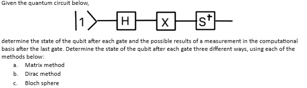
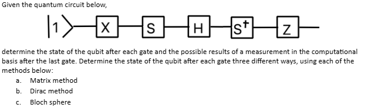
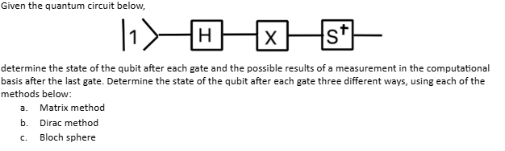
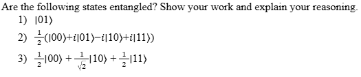
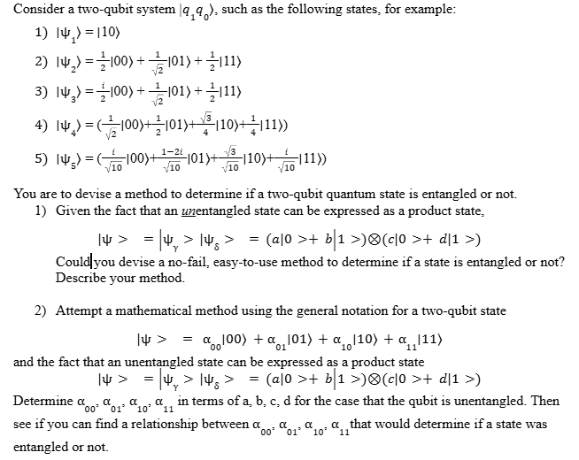
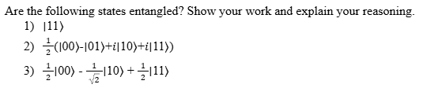
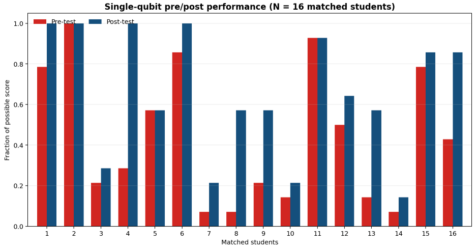
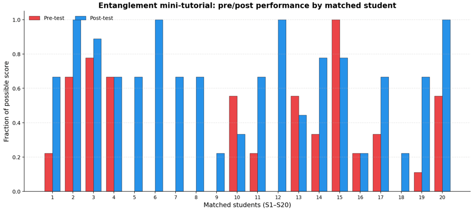

# Mini-tutorials and Pre-/Post-tests

## Sample mini-tutorials and pre- and pos-tests for single-qubit gates and entanglement are presented here. 

### <u>Single-qubit Gates</u>

The purpose of the single-qubit gate mini-tutorial is to have students work through a circuit of single-qubit gates in three different representations: matrix, Dirac and Bloch sphere rotations. 

#### <u>Pre-test</u>

#### <u>Mini-tutorial</u>

#### <u>Post-test</u>

### <u>Entanglement</u>
The entanglement mini-tutorial is designed to allow them first to see if they can find a method to determine if a two-qubit state is entangled or not. And then to ask them to attempt a mathematical method based on the definition of an unentangled state.

#### <u>Pre-test</u>

#### <u>Mini-tutorial</u>

#### <u>Post-test</u>

Other mini-tutorials either developed or in-process are listed below. The starred (*) mini-tutorials have pre-/post-tests developed and analyzed:
* *Probability in the context of a Stern-Gerlach analyzer
* *Single Qubit Gates
* Multi-qubit Gtates
* Generating Bell States
* *Entangled States
* Phase Kickback
* *Teleportation
* *Phase Oracle
* *Deutsch’s Algorithm
* *Quantum Fourier Transform

### Rubrics
#### <u>Single-qubit Gates</u>

Each section of the three methods were awarded 2, 1 or 0 points based on if the answer was completely correct, partially correct or incorrect.

Matrix 			
* Format of state
* Gate calculation	
* Final Answer

Dirac			
* Correct Dirac form
* Final answer

Bloch sphere		
* Correct rotation	
* Correct answer
			

#### <u>Entanglement</u>

Each problem part was analyzed for a correct answer and correct reasoning as follows:

Answer		
* 1pts:		Correct
* 0pts:		Incorrect

Reasoning
* 2pts:		Correct
* 1pts:		Partially correct/Incomplete
* 0pts:		Incorrect/No justification

The answer was not counted correct without correct reasoning.

We also recorded the method: mental factoring, equation, etc.

### Data

### <u>Single-qubit Gates</u>

A graph of each students’ pre- and post- points as a fraction of the possible points. Pre-test is in red, post-test is in blue. If there is no bar for a particular student, that means the number of points was zero.

### <u>Entanglement</u>

A graph of each students’ pre- and post- points as a fraction of the possible points. Pre-test is in red, post-test is in blue. If there is no bar for a particular student, that means the number of points was zero.

[View Project Overview](./index) 

